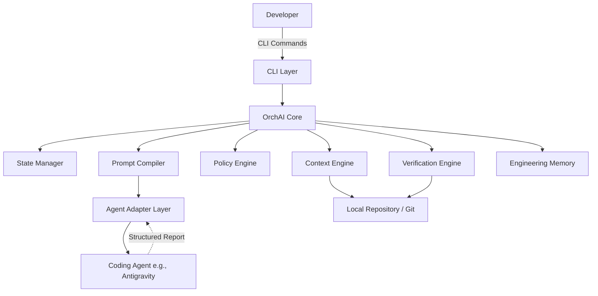

# OrchAI Architecture Proposal

## 1. High-Level Architecture

OrchAI is designed as a local-first CLI tool for the MVP, written in a fast, compiled language like Go, Rust, or Python with strict typing, prioritizing minimal dependencies and robust CLI capabilities. We will use **Python (with strict typing and minimal dependencies)** for the MVP to enable rapid iteration, leveraging standard libraries and lightweight CLI frameworks like `click` or `typer`.

## 2. Core Modules

### 2.1 CLI Layer (`orchai.cli`)
Handles user interactions, task creation, and human-in-the-loop approvals.

### 2.2 Core Engine (`orchai.core`)
The orchestrator that drives the main execution loop: `Understand -> Plan -> Optimize -> Govern -> Execute -> Observe -> Verify -> Approve -> Remember`.

### 2.3 Context Engine (`orchai.context`)
Manages the structured understanding of the project. Extracts relevant files and architectural knowledge without reading the entire repository.

### 2.4 State Manager (`orchai.state`)
Maintains the task state machine (PENDING, EXECUTING, VERIFYING, etc.) and persists state locally (e.g., in `.orchai/state.json`).

### 2.5 Policy Engine (`orchai.policy`)
Evaluates intended and actual agent actions against security and governance rules (e.g., forbidden directories, approval requirements).

### 2.6 Agent Adapter Layer (`orchai.adapters`)
Provides an interface (`AgentAdapter`) for interacting with various coding agents. The MVP will include `AntigravityAdapter`.

### 2.7 Verification Engine (`orchai.verification`)
Independently verifies agent output via Git diffs, running tests, and executing lint/build commands.

### 2.8 Engineering Memory (`orchai.memory`)
Stores architectural decisions, past task contexts, and project constraints (e.g., `.orchai/memory.json`).

## 3. Technology Stack (MVP)
- **Language:** Python 3.11+
- **CLI Framework:** Typer
- **Data Validation:** Pydantic
- **State/Config Storage:** Local JSON/YAML inside `.orchai/`
- **Version Control Interface:** Git CLI via subprocess

## 4. Risks and Assumptions
- **Assumption:** Coding agents can reliably output structured reports. *Risk Mitigation: Robust parsing and fallback verification in the Adapter Layer.*
- **Assumption:** Local execution is sufficient for MVP. *Risk Mitigation: Designing modular adapters to swap local execution for API calls later.*
- **Risk:** Agents circumventing the adapter interface. *Risk Mitigation: Strict verification via Git diffs before committing or approving changes.*
