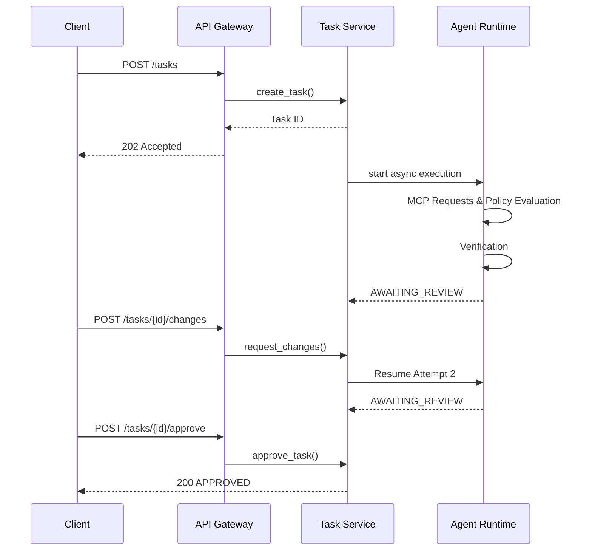

# Phase 18: Multiturn Orchestration

## Overview
Phase 18 establishes OrchAI as a fully asynchronous, persistent, multiturn governance runtime for headless agents. It enables clients to submit tasks asynchronously, monitor execution, and engage in multiple review cycles (attempts) without losing context or requiring native Antigravity IDE capabilities.

## Architecture

## Key Capabilities
- **Async Execution**: `POST /tasks` returns 202 immediately. Execution progresses in the background (`TaskState.EXECUTING`, `VERIFYING`, `AWAITING_REVIEW`).
- **Idempotency**: Providing `Idempotency-Key` prevents duplicate execution requests.
- **Session Continuity**: Multi-turn review loops transition states predictably (`CHANGES_REQUESTED` -> `Attempt #2`). Attempt history remains intact.
- **Event Streaming**: Deterministic structured events emitted at every step.
- **Crash Recovery**: Missing background tasks for `EXECUTING` tasks are marked `RECOVERY_REQUIRED` on startup.
- **Cancellation**: Full isolation and asynchronous cancellation propagation.
